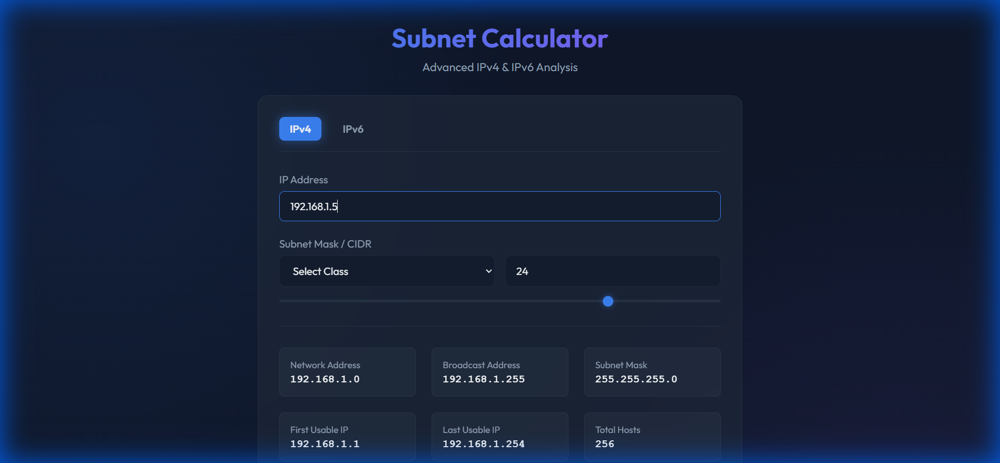
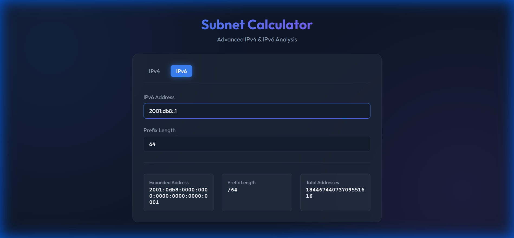

# Subnet Calculator Walkthrough

I have successfully built and verified the Subnet Calculator web application. It supports both IPv4 and IPv6 calculations with a premium, dark-themed UI.

## Features Verified

### IPv4 Calculation
- **Input**: Smart handling of IP and CIDR.
- **Output**: Calculates Network Address, Broadcast, Usable Range, and Host counts.
- **Visuals**: Binary representation included.

### IPv6 Calculation
- **Input**: Supports standard IPv6 addresses and prefix lengths.
- **Output**: Expands short-form addresses and calculates approximate total addresses.

## Implementation Details

- **Tech Stack**: Vanilla JavaScript (no framework overhead) + Vite.
- **Styling**: Custom CSS with Glassmorphism and responsive design.
- **Logic**: Modular separation of IPv4/IPv6 logic in `subnet.js`.

The application is running locally at `http://localhost:5173/`.
